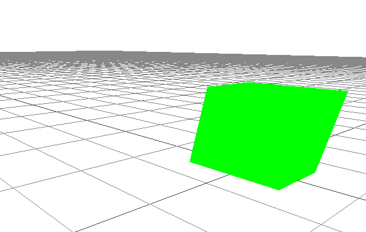
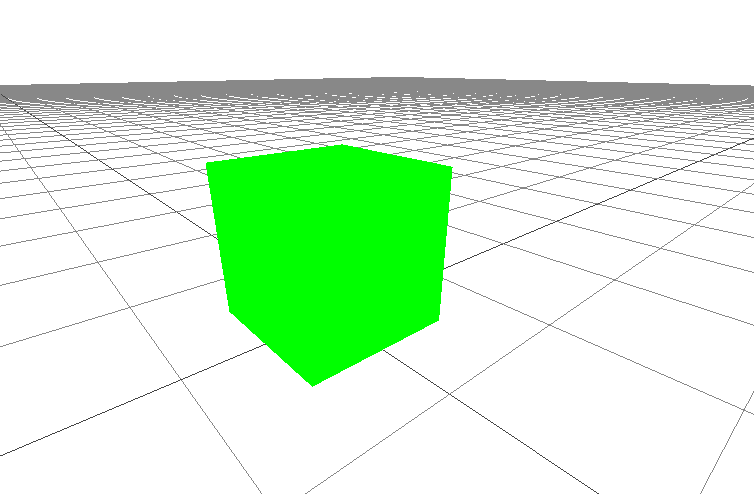
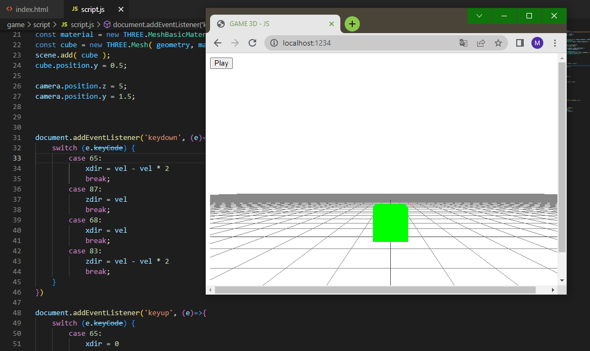

<h1 align="center">GAME 3D</h1>
<h3>IMPORTANT!!!</h2>
:construction: Project under construction :construction:
<h3>EXECUTE THE TERMINAL COMMANDS: </h3>
<ol>
  <li>C:\Users\User\Desktop\game3d> npm i parcel -g</li>
  <li>C:\Users\User\Desktop\game3d\game> npm i three</li>
</ol>
<h3>you need to run the following commands to create a localhost with Parcel</h3>

C:\Users\User\Desktop\game3d> parcel ./game/index.html

<h2 align="center">ABOUT</h2>

~~~~~~~> this game was made only for the purpose of testing the Three.js library, so there may be bugs!!! <~~~~~~~

  
<h2>COMMANDS: WASD & MOUSE</h2>

